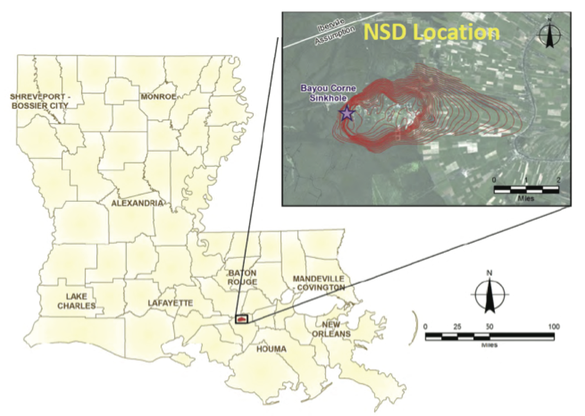

# Seismic Features For Machine Learning                                                              

This repository contains a collection of codes used for extracting features from seismic signals presented in: 

`Mousavi, S. M., S. P. Horton, C. A. Langston, B. Samei (2016). Seismic Features and Automatic
      Discrimination of Deep and Shallow Induced-Microearthquakes Using Neural Network and Logistic Regression, 
      Geophysical Journal International, 207(1), 29-46, doi:10.1093/gji/ggw258`
      
 ------------------------------------------- 
     
   BibTeX:
   
        @article{mousavi2016seismic,
            title={Seismic features and automatic discrimination of deep and shallow induced-microearthquakes using neural    network and logistic regression},
            author={Mousavi, S Mostafa and Horton, Stephen P and Langston, Charles A and Samei, Borhan},
            journal={Geophysical Journal International},
            volume={207},
            number={1},
            pages={29--46},
            year={2016},
            publisher={Oxford University Press}
            }

------------------------------------------- 

Paper: 

(https://academic.oup.com/gji/article/207/1/29/2583533)

(https://www.researchgate.net/publication/305314786_Seismic_features_and_automatic_discrimination_of_deep_and_shallow_induced-microearthquakes_using_neural_network_and_logistic_regression)

------------------------------------------- 

## Short Description
In this paper we applied supervised machine learning techniques (neural net and logistic regression) to discriminate two groups pf very small earthquakes (-1.7< Magnitudes < 1.29) occuring close to each others (~ 800 m) based on their source depths. This is done using many features measured in time, frequency, and time-frequency domain from seismic signal recorded on a limited number of surface receivers. 
Some of the features used in this study are introduced for seismic study for first time. Moreover unsupervised techniques ( CFS and X-mean) were used to explore the correlations of different features with source depth.

## Data
5688 single channel record from 440 microearthquakes induced by an underground cavern collapse in the Napoleonville Salt Dome in Bayou Corne, Louisiana. 

## Results
The cross validation test showed that events with depth shallower than 250 m can be discriminated from events with hypocentral depth between 1000 to 2000 m with 88% and 90.7% accuracy using logistic regression (LR) and neural network (NN) models, respectively. Similar results were obtained using single station seismograms. The results show that the spectral features have the highest correlation to source depth. Spectral centroids and 2D cross-correlations in the time-frequency domain are two new seismic features used in this study that showed to be promising measures for seismic event classification. The used machine learning techniques have application for efficient automatic classification of low energy signals recorded at one or more seismic stations.

